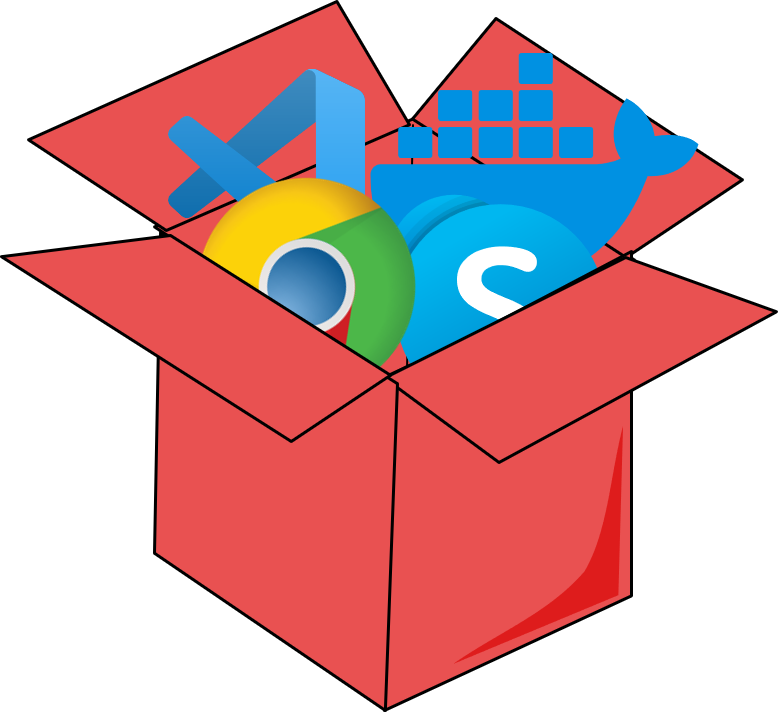

<h1 align="center">
   
  
   
  Boxer
   
</h1>

<h4 align="center">Boxer is cli tool that helps launch Windows Sandbox with preinstalled applications and/or with predefined scripts.</h4>
<h4 align="center">:star: Stars on GitHub always helps!</h4>

  

  <a href="#more-about-windows-sandbox">Windows Sandbox</a> •
  <a href="#how-scoopbox-works">ScoopBox</a> •
  <a href="#examples">Boxer</a> •
  <a href="#download">Download</a> •
  <a href="#contribute">Contribute</a>

# Boxer
Boxer is a cli tool that launches Windows Sandbox with preinstalled applications and/or executes scripts at startup.
